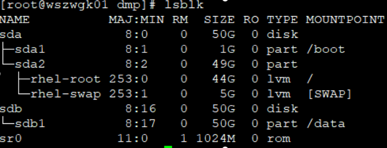
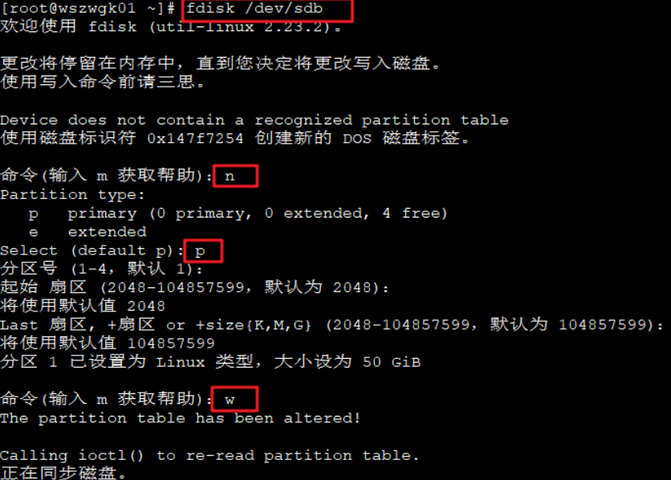
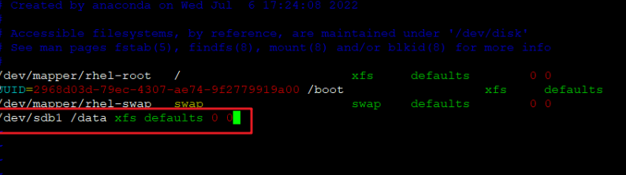

# Centos7
## 关闭防火墙
```shell
systemctl stop firewalld.service
systemctl disable firewalld.service
# 查看状态
systemctl status firewalld.service
```
## 解决Xshell ssh登录慢问题
编辑文件：`vi /etc/ssh/sshd_config`
找到GSSAPIAuthentication值改为no
找到UseDNS，将注释放开，值改为yes
保存文件。
执行命令，重启sshd\
```systemctl restart sshd```

## 关闭selinux
vi /etc/selinux/config \
SELINUX=disabled （设置安全选项关闭,重启生效）

## 配置双机SSH免密访问
1）修改/etc/ssh/sshd_config \
```vim /etc/ssh/sshd_config```
将PermitRootLogin yes的注释去掉，然后保存，重启ssh：\
```systemctl restart sshd```

2）root用户分别执行
- 生成密钥 \
`ssh-keygen -t rsa`
- 查看密钥 \
`cat ~/.ssh/id_rsa.pub`
- 分别将密钥传输到对方机器
```bash
ssh-copy-id -i ~/.ssh/id_rsa.pub root@192.168.56.101
ssh-copy-id -i ~/.ssh/id_rsa.pub root@192.168.56.100
```
- 分别添加/ect/hosts \
192.168.56.101 wszwgk01 \
192.168.56.102 wszwgk02
- 测试
`ssh wszwgk01`

## 挂载磁盘
在virtualbox虚拟机设置中添加1块硬盘。启动虚拟机后，执行：
- 查看磁盘
```
fdisk -l
lsblk
```

```bash
# 创建分区
fdisk /dev/sdb
# 依次输入：n, p,后面选项默认
# 最后输入：w 执行写入
```

```bash
# 格式化
mkfs.xfs /dev/sdb1
# 挂载分区到/data目录，
mkdir data
vim /etc/fstab
```


