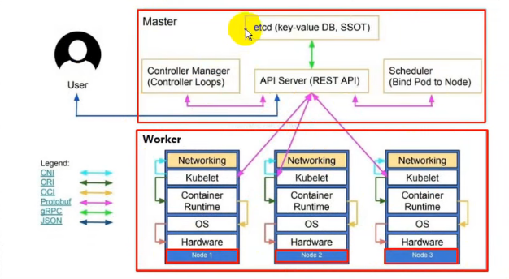
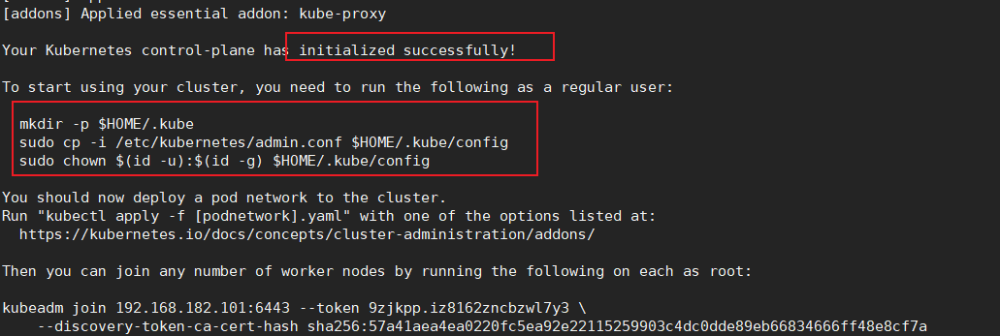
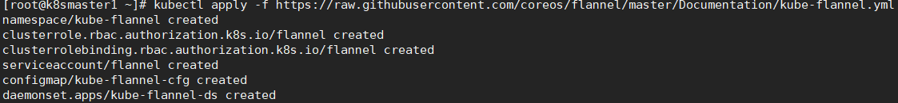
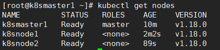
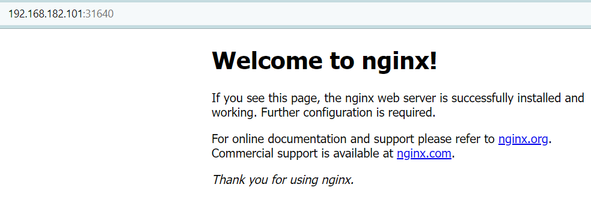

## 基础
### 关于kubectl、Kubelet和Kubeadm
kubectl：是Kubernetes 的命令行工具，人们通常通过它与Kubernetes 进行交互。\
Kubelet：是kubernetes 工作节点上的一个代理组件，运行在每个节点上。
Kubeadm：是一个提供了 kubeadm init 和 kubeadm join 的工具， 作为创建Kubernetes 集群的“快捷途径” 的最佳实践（用于创建集群）

### namespace命名空间
```bash
kubectl get namespace
kubectl create namespace test
```

### pod、service、deployment关系？
- pod：k8s集群调度得最小单元，1个pod可包含多个容器，类比豌豆荚。
- service：访问pod的入口，通过pod标签与pod进行关联
  - ClusterIP 默认
  - NodePort: 每个node上分配一个端口作为外部访问入口

### 有状态服务和无状态服务？
1. 有状态的应用副本名是有规则的，且重启后副本名称不会变，例如部署个mysql，两个副本：mysql-1､mysql-2,重启后依旧是mysql-1/2;而无状态的副本重启会名称会变；
2. 可以为有状态的副本创建headless服务，这时候mysql-1解析到的是POD的IP；如果用服务名访问，则会依次解析到不同的PODIP（就是第一次解析到mysql-1,第二次解析到mysql-2)；
3. 使用pvc时，无状态的只有一个副本能挂上pv，有状态的每一个副本都会挂到一个pv，且重启后会确保挂到重启前的pv上。

## 节点架构

- Api Server：所有服务访问的唯一入口
- Controller Manager：维护副本数量
- Scheduler：负责工作负载利用率，并将Pod分配给新节点。
- ETCD：键值对数据库，负责存储k8s集群所有重要信息
- Kubelet：直接和容器引擎交互实现容器的生命周期管理
- kube proxy：负责写入规则至iptables、ipvs实现服务映射访问
- CoreDNS：可以为集群中的SVC创建一个域名IP的对应关系解析
- Dashboard：给K8s集群提供一个B/S结构访问体系
- Ingress Controller：官方只能实现四层代理，Ingress可以实现七层代理
- Federation：提供一个可以跨集群中心多K8s统一管理功能
- ELK：提供k8s集群日志统一分析接入平台
- Prometheus：提供k8s集群的监控能力

# 集群搭建
参考：https://www.modb.pro/db/332165
> 如果没有特别说明，以下操作在3个节点都要执行！
## 节点规划
- 操作系统：centos7.9

主节点：192.168.182.101 2c2g 20g存储 \
工作节点：192.168.182.102 2c2g 20g存储 \
工作节点：192.168.182.103 2c2g 20g存储 

## 安装虚拟机
- 配置主机名
```shell
# 根据规划设置主机名【k8smaster1 节点上操作】
hostnamectl set-hostname ks8master1
# 根据规划设置主机名【k8snode1 节点上操作】
hostnamectl set-hostname k8snode1
# 根据规划设置主机名【k8snode2 节点操作】
hostnamectl set-hostname k8snode2
```
- 配置hosts
```shell
cat >> /etc/hosts << EOF
192.168.182.101 k8smaster1
192.168.182.102 k8snode1
192.168.182.103 k8snode2
EOF
```
- 配置网络
将原有dhcp模式改为指定静态IP
```bash
cat /etc/sysconfig/network-scripts/ifcfg-ens33

TYPE="Ethernet"
PROXY_METHOD="none"
BROWSER_ONLY="no"
BOOTPROTO="static"
DEFROUTE="yes"
IPV4_FAILURE_FATAL="no"
IPV6INIT="yes"
IPV6_AUTOCONF="yes"
IPV6_DEFROUTE="yes"
IPV6_FAILURE_FATAL="no"
IPV6_ADDR_GEN_MODE="stable-privacy"
NAME="ens33"
UUID="9541c16d-03e2-4601-b378-d118d9feeb8c"
DEVICE="ens33"
ONBOOT="yes"
IPADDR="192.168.182.101"
PREFIX="24"
GATEWAY="192.168.182.2"
DNS1="119.29.29.29"
```
- 更改yum源
```bash
cd /etc/yum.repos.d/
wget -O /etc/yum.repos.d/CentOS-Base.repo http://mirrors.aliyun.com/repo/Centos-7.repo
# 清空本地缓存
yum clean all
# 新生成缓存
yum makecache
```
- 关闭selinux
```bash
# 关闭 selinux
# 临时关闭【立即生效】告警，不启用，Permissive，查看使用 getenforce 命令
setenforce 0  
# 永久关闭【重启生效】
sed -i 's/SELINUX=enforcing/\SELINUX=disabled/' /etc/selinux/config  
```

- 关闭swap
```bash
# 关闭 swap
# 临时关闭【立即生效】查看使用 free 命令
swapoff -a 
# 永久关闭【重启生效】
sed -ri 's/.*swap.*/#&/' /etc/fstab
```
- 主机时间同步
```bash
# 安装依赖包
yum install ntpdate
ntpdate ntp1.aliyun.com
# 配置定时任务
crontab -e

0 */1 * * * ntpdate ntp1.aliyun.com
```
- 设置防火墙为 Iptables 并设置空规则
```bash
systemctl stop firewalld && systemctl disable firewalld

yum -y install iptables-services && systemctl start iptables && systemctl enable  iptables && iptables -F && service iptables save
```

- 配置网桥和地址转发
```bash
vi /etc/sysctl.d/k8s.conf

cat  >  /etc/sysctl.d/k8s.conf  <<EOF 
net.bridge.bridge-nf-call-iptables=1
net.bridge.bridge-nf-call-ip6tables=1
net.ipv4.ip_forward=1
net.ipv4.tcp_tw_recycle=0
vm.swappiness=0  #  禁止使用swap  空间，只有当系统  OOM  时才允许使用它
vm.overcommit_memory=1  #  不检查物理内存是否够用
vm.panic_on_oom=0  #  开启  OOM
fs.inotify.max_user_instances=8192 fs.inotify.max_user_watches=1048576 
fs.file-max=52706963 
fs.nr_open=52706963 
net.ipv6.conf.all.disable_ipv6=1 
net.netfilter.nf_conntrack_max=2310720
EOF

# 加载网桥过滤模块
modprobe br_netfilter
modprobe ip_conntrack
lsmod | grep conntrack

sysctl -p /etc/sysctl.d/k8s.conf
```

- 关闭多余服务
```bash
systemctl stop postfix && systemctl disable postfix
```

- 开启ipvs
```bash
# 安装ipset及ipvsadm
yum -y install ipset ipvsadm
```
在所有节点执行脚本：
```bash
cat > /etc/sysconfig/modules/ipvs.modules <<EOF
modprobe -- ip_vs                                                                       
modprobe -- ip_vs_rr
modprobe -- ip_vs_wrr
modprobe -- ip_vs_sh
modprobe -- nf_conntrack_ipv4
EOF

chmod 755 /etc/sysconfig/modules/ipvs.modules && bash /etc/sysconfig/modules/ipvs.modules &&lsmod | grep -e ip_vs -e nf_conntrack_ipv4

```
- 升级系统内核
```bash
rpm  -Uvh  http://www.elrepo.org/elrepo-release-7.0-3.el7.elrepo.noarch.rpm
#  安装完成后检查  /boot/grub2/grub.cfg  中对应内核  menuentry  中是否包含  initrd16  配置，如果没有，再安装一次！
yum  --enablerepo=elrepo-kernel  install  -y  kernel-lt # 设置开机从新内核启动
grub2-set-default  'CentOS  Linux  (4.4.189-1.el7.elrepo.x86_64)  7  (Core)'

uname -r
# 5.4.212-1.el7.elrepo.x86_64
```


## 安装docker
- 获取yum源
```bash
# 配置 docker 的 yum 源【阿里云】
cat >/etc/yum.repos.d/docker.repo<<EOF
[docker-ce-edge]
name=Docker CE Edge - \$basearch
baseurl=https://mirrors.aliyun.com/docker-ce/linux/centos/7/\$basearch/edge
enabled=1
gpgcheck=1
gpgkey=https://mirrors.aliyun.com/docker-ce/linux/centos/gpg
EOF
```
```bash
yum list docker-ce.x86_64 --showduplicates | sort -r
# yum 方式安装 docker
yum -y install --setopt=obsoletes=0 docker-ce-18.06.3.ce-3.e17

yum -y install docker-ce
# 查看 docker 版本
docker --version
 
# 配置 docker 的镜像源【阿里云】
mkdir /etc/docker

cat >> /etc/docker/daemon.json << EOF
{
  "registry-mirrors": ["https://b9pmyelo.mirror.aliyuncs.com"]
}
EOF
```
```bash
# 运行 docker 自启
systemctl enable docker
# 启动 docker
systemctl start docker
# 查看 docker 状态
systemctl status docker
```

## 安装 kubeadm，kubelet 和 kubectl
```bash
# 配置 k8s 的 yum 源【阿里云】
cat > /etc/yum.repos.d/kubernetes.repo << EOF
[kubernetes]
name=Kubernetes
baseurl=https://mirrors.aliyun.com/kubernetes/yum/repos/kubernetes-el7-x86_64
enabled=1
gpgcheck=0
repo_gpgcheck=0
gpgkey=https://mirrors.aliyun.com/kubernetes/yum/doc/yum-key.gpg https://mirrors.aliyun.com/kubernetes/yum/doc/rpm-package-key.gpg
EOF
```
```bash
# 安装 kubelet、kubeadm、kubectl，同时指定版本 1.18.0
yum install -y kubelet-1.18.0 kubeadm-1.18.0 kubectl-1.18.0
# 设置开机自启
systemctl enable kubelet
systemctl start kubelet
```

## 初始化集群
`master节点操作`
```bash
kubeadm init --apiserver-advertise-address=192.168.182.101 \
 --image-repository registry.aliyuncs.com/google_containers \
 --kubernetes-version v1.18.0 --service-cidr=10.96.0.0/12 \
 --pod-network-cidr=10.244.0.0/16
# apiserver地址为master节点地址

# 记住命令
kubeadm join 192.168.182.101:6443 --token 9zjkpp.iz8162zncbzwl7y3 \
    --discovery-token-ca-cert-hash sha256:57a41aea4ea0220fc5ea92e22115259903c4dc0dde89eb66834666ff48e8cf7a
```


- `master节点操作`
```bash
mkdir -p $HOME/.kube
cp -i /etc/kubernetes/admin.conf $HOME/.kube/config
chown $(id -u):$(id -g) $HOME/.kube/config
```
### CNI网络插件
`master节点操作`
```bash
kubectl apply -f https://raw.githubusercontent.com/coreos/flannel/master/Documentation/kube-flannel.yml
```


### 将节点node1和node2加入集群
执行上面的kubeadm join...命令
```bash
# 查看节点状态
kubectl get node
```


## 测试集群
`master节点操作`
- 在Kubernetes集群中创建一个pod，验证是否正常运行
```bash
# 下载nginx 会联网 pull nginx image
kubectl create deployment nginx --image=nginx
# 查看状态
kubectl get pod
# 暴露端口
kubectl expose deployment nginx --port=80 --type=NodePort
# 查看一下对外的端口
kubectl get pod,svc

# 查看集群状态
kubectl get cs
kubectl cluster-info
```


## 异常处理
### error: Missing or incomplete configuration info
```bash
vim /etc/profile
# 新增一行
export KUBERNETES_MASTER="127.0.0.1:8080"
# 保存退出
source /etc/profile
# 刷新环境变量
```

# kubectl常用命令
### pod操作
```bash
kubectl get pod
# 查看指定命名空间下pod
kubectl get pod -n kube-system
# 查看pod状态
kubectl describe pod
# 查看一下对外的端口
kubectl get pod,svc
# 删除pod
kubectl delete pods podname -n default
```
### service操作
```bash
kubectl expose deployment.apps nginx-app --type=ClusterIP --target-port=80 --port=80
```
# 资源清单文件

- 创建service

`create-deployment-service-clusterip.yaml`
```yaml
---
apiVersion: apps/v1
kind: Deployment
metadata:
  name: nginx-app2
spec:
  replicas: 2
  selector:
    matchLabels:
      apps: nginx
  template:
    metadata:
      labels:
        apps: nginx
    spec:
      containers:
      - name: nginxapp2
        image: nginx:latest
        imagePullPolicy: IfNotPresent
        ports:
        - containerPort: 80
---
apiVersion: apps/v1
kind: Service
metadata:
  name: nginx-app2-svc
spec:
  type: ClusterIP
  ports:
  - protocol: TCP
    port: 80
    targetPort: 80
  selector:
    apps: nginx
```
```bash
kubectl apply -f create-deployment-service-clusterip.yaml
```