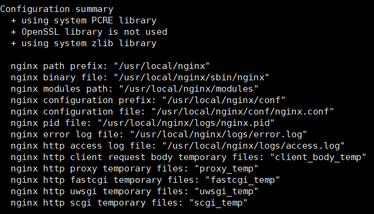
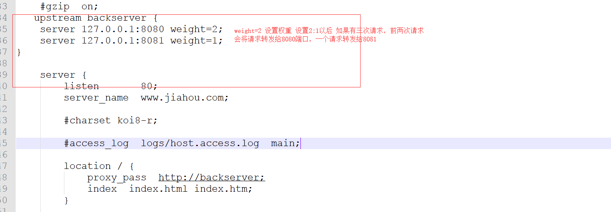

## 编译安装
```bash
yum -y install gcc pcre pcre-devel zlib zlib-devel openssl openssl-devel
./configure --with-http_ssl_module --with-http_sub_module
make
make install

whereis nginx
ln -s /usr/local/nginx/sbin/nginx /usr/bin

```
- 设置nginx自启
在rc.local中添加启动代码:
```bash
vim /etc/rc.local
# 在文件末尾添加一句 /usr/local/nginx/sbin/nginx
# 重新赋予权限
chmod 755 rc.local
```
- 安装为系统服务
```bash
vi /usr/lib/systemd/system/nginx.service
systemctl daemon-reload
systemctl start nginx.service
```
```bash
[Unit]
Description=nginx - web server
After=network.target remote-fs.target nss-lookup.target
[Service]
Type=forking
PIDFile=/usr/local/nginx/logs/nginx.pid
ExecStartPre=/usr/local/nginx/sbin/nginx -t -c /usr/local/nginx/conf/nginx.conf
ExecStart=/usr/local/nginx/sbin/nginx -c /usr/local/nginx/conf/nginx.conf
ExecReload=/usr/local/nginx/sbin/nginx -s reload
ExecStop=/usr/local/nginx/sbin/nginx -s stop
ExecQuit=/usr/local/nginx/sbin/nginx -s quit
PrivateTmp=true
[Install]
WantedBy=multi-user.target
```

```bash
# 重新启动nginx服务
systemctl reload nginx

#开机启动  
systemctl enable nginx.service
```

-  重启nginx
```bash
nginx -s reload
# 启动
nginx
# 停止
nginx -s stop
# 重启
nginx -s reload
# 检查文件是否正确（修改配置文件后都必须检查，不然网站部署会出现问题）
nginx -t

```


## 反向代理
```bash
server_name www.nginxtest.com;

location /nginxtest/ {
    proxy_pass http://127.0.0.1:8080/;
}

- 添加谷歌代理
```bash
server {
    server_name 192.168.xx.xx;

    location / {
        proxy_pass https://www.google.com/;

        proxy_redirect https://www.google.com/ /;
        proxy_cookie_domain google.com 192.168.xx.xx;

        proxy_set_header User-Agent $http_user_agent;
        proxy_set_header Cookie "PREF=ID=047808f19f6de346:U=0f62f33dd8549d11:FF=2:LD=zh-CN:NW=1:TM=1325338577:LM=1332142444:GM=1:SG=2:S=rE0SyJh2W1IQ-Maw";
        # 这里设置cookie，这里是别人给出的一段，必要时请放上适合你自己的cookie
        # 设置这个可以避免一些情况下的302跳转，如果google服务器返回302 redirect，那么浏览器被跳转到google自己的域名，那就没的玩了

        proxy_set_header X-Real-IP $remote_addr;
        proxy_set_header X-Forwarded-For $proxy_add_x_forwarded_for;

        sub_filter  http://www.google.com http://192.168.xx.xx;
        sub_filter  https://www.google.com http://192.168.xx.xx;
        # 这里替换网页中的链接，因为我们的镜像站是http的，所以上面顺便把协议也一起替换了
 }
}
```


```
- 模拟504错误
```java
/**
 *  测试nginx用的接口
 */
@Controller
@RequestMapping("/nginx")
public class NginxTestController {
    /**
     *  模拟网关超时504
     * @return
     * @throws InterruptedException
     */
    @GetMapping("/timeout")
    @ResponseBody
    public String timeout() throws InterruptedException {
        // 30s后返回结果
        Thread.sleep(30000);

        return "success";
    }
}
```
- 设置nginx等待后端返回超时时间（默认60s）
```bash
proxy_connect_timeout    20;  #nginx跟后端服务器连接超时时间(代理连接超时)默认60s
proxy_read_timeout       20; #后端服务器数据回传时间(代理发送超时)默认值60s
proxy_send_timeout       20;  #连接成功后，后端服务器响应时间(代理接收超时)默认值60s
```

## 限流
https://www.freesion.com/article/29971328266/

## 负载均衡
- 算法：
`轮询`，`ip哈希`,`随机`
```bash
upstream appserver{
    server 192.168.44.102 weight=8 down;
    server 192.168.44.103 weight=2;
    server 192.168.44.104 weight=1 backup;
}
```
## URLRewrite
```bash
location / {
    rewrite ^/([0-9]+).html$ /index.jsp?pageNum=$1 break;
    proxy_pass http://192.168.159.104;
}
```
## 防盗链





