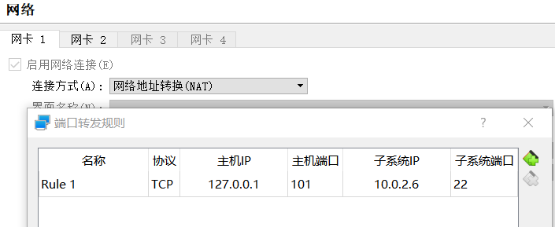

# 网络配置
## virtualbox配置nat网络
- 工具配置nat端口转发规则

- centos7
```bash
vim /etc/sysconfig/network-scripts/ifcfg-enp0s3

TYPE="Ethernet"
PROXY_METHOD="none"
BROWSER_ONLY="no"
BOOTPROTO="static"
DEFROUTE="yes"
IPV4_FAILURE_FATAL="no"
IPV6INIT="yes"
IPV6_AUTOCONF="yes"
IPV6_DEFROUTE="yes"
IPV6_FAILURE_FATAL="no"
IPV6_ADDR_GEN_MODE="stable-privacy"
NAME="enp0s3"
UUID="4db2fd13-13d0-4c0f-bbd7-16b4cb0d449c"
DEVICE="enp0s3"
ONBOOT="yes"
IPADDR=10.0.2.6
GATEWAY=10.0.2.2
NETMASK=255.255.255.0
DNS1=114.114.114.114
```
```bash
# 重启网络
service network restart
ping www.baidu.com
```
