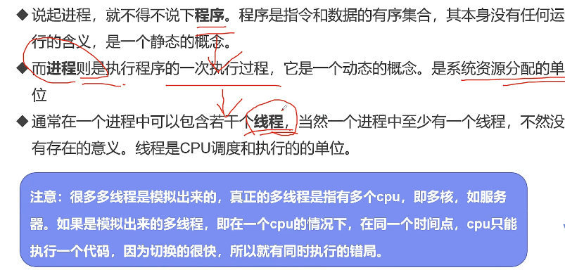
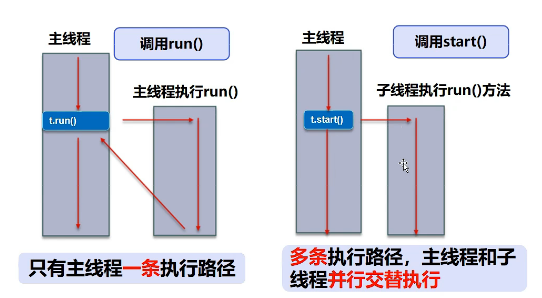
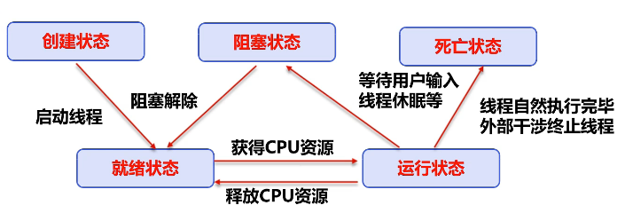
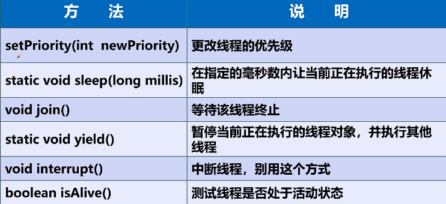
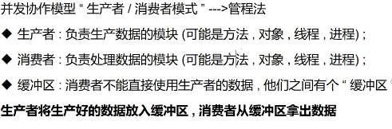

## 进程和线程


## 创建线程
- 继承Thread
```java
public class ThreadCreate01 extends Thread{
    @Override
    public void run() {
        for (int i = 0; i < 20; i++) {
            System.out.println("I'm coding---"+i);
        }
    }

    public static void main(String[] args) {
        ThreadCreate01 t1 = new ThreadCreate01();
        // t1.start();
        t1.run();
        for (int i = 0; i < 20; i++) {
            System.out.println("我在写多线程代码+++"+i);
        }
    }
}

```
- 实现Runnable接口（推荐）
> 避免单继承局限，方便同一对象被多个现场使用
```java
public class RunnableCreateThread implements Runnable {
    @Override
    public void run() {
        for (int i = 0; i < 20; i++) {
            System.out.println("I'm coding---"+i);
        }
    }

    public static void main(String[] args) {
        RunnableCreateThread rt = new RunnableCreateThread();
        Thread t1 = new Thread(rt);
        t1.start();

        for (int i = 0; i < 20; i++) {
            System.out.println("我在写多线程代码+++"+i);
        }
    }
}
```
- 实现Callable接口

- run和start方法区别


## 案例1：龟兔赛跑
```java
public class TorRabbitRace implements Runnable {
    private String winner;

    // 谁先跑完100步谁赢
    @Override
    public void run() {
        for (int i = 1; i <= 100; i++) {
            // 判断当前线程名称如果为兔子就10的倍数步数停10毫秒，确保乌龟赢
            if(Thread.currentThread().getName().equals("兔子") && i%10==0){
                try {
                    Thread.sleep(10);
                } catch (InterruptedException e) {
                    e.printStackTrace();
                }
            }
            System.out.println(Thread.currentThread().getName()+"跑了"+i+"步");
            // 判断是否出现胜者
            if(gameover(i)){
                break;
            }
        }
    }
    
    boolean gameover(int steps){
        if(!StringUtils.isEmpty(winner)){
            System.out.println("比赛结束！胜者为："+winner);
            return true;
        }
        if(steps>=100){
            winner = Thread.currentThread().getName();
            System.out.println("胜者为："+winner);
            return true;
        }
        return false;
    }

    public static void main(String[] args) {
        TorRabbitRace trr = new TorRabbitRace();
        Thread tor = new Thread(trr,"乌龟");
        Thread tr = new Thread(trr,"兔子");
        tor.start();
        tr.start();
    }
}
```
## 线程状态


## 线程方法


## 线程停止
> 推荐使用标志位方式
```java
public class ThreadStop implements Runnable {
    // 设置flag
    private boolean flag = true;

    @Override
    public void run() {
        int i = 0;
        while (flag){
            System.out.println("run..."+i++);
        }
    }

    public void stop(){
        this.flag = false;
    }

    public static void main(String[] args) {
        ThreadStop t1 = new ThreadStop();
        new Thread(t1).start();

        for (int i = 0; i < 1000; i++) {
            System.out.println("main"+i);
            if(i == 900){
                t1.stop();
                System.out.println("run线程停止了");
            }
        }
    }
}
```

## 线程礼让 yield
## 线程插队 join
```java
public class ThreadJoin implements Runnable{
    @Override
    public void run() {
        for (int i = 0; i < 1000; i++) {
            System.out.println("VIP来了"+i);
        }
    }

    public static void main(String[] args) throws InterruptedException {
       ThreadJoin tj = new ThreadJoin();
       Thread t1 = new Thread(tj);
       t1.start();

        for (int i = 0; i < 500; i++) {
            if(i==200){
                t1.join();
            }
            System.out.println("main"+i);
        }
    }
}
```
## 线程优先级
> 1-10数字越大优先级越高，main优先级为5


## 线程同步
> 锁的对象就是变化的量，增删改的量

```java
public class ThreadSynchronized{
    public static void main(String[] args) {
        Account account = new Account(100,"结婚基金");
        Drawing you = new Drawing(account,50,"你");
        Drawing gf = new Drawing(account,100,"gf");
        you.start();
        gf.start();
    }
}

class Drawing extends Thread{
    private Account account;
    private int drawingMoney;
    private int nowMoney;

    public Drawing(Account account,int drawingMoney,String name){
        super(name);
        this.account = account;
        this.drawingMoney = drawingMoney;
    }
    @Override
    public void run() {
        synchronized (account){
            if(account.money-drawingMoney < 0){
                System.out.println("余额不足！"+Thread.currentThread().getName()+"无法取"+drawingMoney);
                return;
            }
            account.money -= drawingMoney;
            nowMoney += drawingMoney;

            System.out.println(account.name+"余额为："+account.money);
            System.out.println(this.getName()+"手里的钱："+nowMoney);
        }
    }
}

// 账户
class Account{
    int money;
    String name;

    public Account(int money,String name){
        this.money = money;
        this.name = name;
    }
}
```

## Lock锁
```java
public class ReentrantLockTest implements Runnable{
    int ticketNums = 10;

    private final ReentrantLock lock = new ReentrantLock();

    @Override
    public void run() {
        while (true){
            try{
                lock.lock();
                if(ticketNums > 0){
                    try {
                        Thread.sleep(1000);
                    } catch (InterruptedException e) {
                        e.printStackTrace();
                    }
                    System.out.println(ticketNums--);
                }else {
                    break;
                }
            }finally {
                lock.unlock();
            }
        }
    }

    public static void main(String[] args) {
        ReentrantLockTest  rt = new ReentrantLockTest();
        new Thread(rt,"t1").start();
        new Thread(rt,"t2").start();
        new Thread(rt,"t3").start();
    }
}
```

## 并发协作方式1：管程法


```java
public class ThreadPipMethod {
    public static void main(String[] args) {
        SyncContainer container = new SyncContainer();
        Producer p = new Producer(container);
        Consumer c = new Consumer(container);
        p.start();
        c.start();
    }
}

// 生产者
class Producer extends Thread{
    SyncContainer container;

    public Producer(SyncContainer container){
        this.container = container;
    }

    @Override
    public void run() {
        for (int i = 0; i < 100; i++) {
            container.push(new Chicken(i));
            System.out.println("生产了第"+i+"只鸡");
        }
    }
}

// 消费者
class Consumer extends Thread{
    SyncContainer container;

    public Consumer(SyncContainer container){
        this.container = container;
    }

    @Override
    public void run() {
        for (int i = 0; i < 100; i++) {
            System.out.println("消费了第--->"+container.pop().id+"只鸡");
        }
    }
}

// 商品
class Chicken{
    int id;
    public Chicken(int id){
        this.id = id;
    }
}

// 缓冲区
class SyncContainer{
    // 容器
    Chicken[] chickens = new Chicken[10];
    // 容器计数器
    int count = 0;

    public synchronized void push(Chicken chicken){
        if(count == chickens.length){
            // 生产等待
            try {
                this.wait();
            } catch (InterruptedException e) {
                e.printStackTrace();
            }
        }
        chickens[count] = chicken;
        count++;
        // 通知消费者消费
        this.notifyAll();
    }

    public synchronized Chicken pop(){
        if(count ==0 ){
            // 等待
            try {
                this.wait();
            } catch (InterruptedException e) {
                e.printStackTrace();
            }
        }
        count--;
        Chicken chicken = chickens[count];
        // 消费完，通知生产者生产
        this.notifyAll();

        return chicken;
    }
}
```
## 并发协作方式2：信号灯法
```java
public class ThreadSignalLamp {
    public static void main(String[] args) {
        TV tv = new TV();
        new Player(tv).start();
        new Watcher(tv).start();
    }
}

class Player extends Thread{
    TV tv;
    public Player(TV tv){
        this.tv = tv;
    }

    @Override
    public void run() {
        for (int i = 0; i < 20; i++) {
            if(i%2==0){
                this.tv.play("天天向上");
            }else{
                this.tv.play("随机广告");
            }
        }
    }
}

class Watcher extends Thread{
    TV tv;
    public Watcher(TV tv){
        this.tv = tv;
    }

    @Override
    public void run() {
        for (int i = 0; i < 20; i++) {
            tv.watch();
        }
    }
}

class TV{
    String voice;
    boolean flag = true;

    // 表演
    public synchronized void play(String voice){
        if(!flag){
            try {
                this.wait();
            } catch (InterruptedException e) {
                e.printStackTrace();
            }
        }
        System.out.println("演员表演了："+voice);
        this.notify();
        this.voice = voice;
        this.flag = !this.flag;
    }
    // 观看
    public synchronized void watch(){
        if(flag){
            try {
                this.wait();
            } catch (InterruptedException e) {
                e.printStackTrace();
            }
        }
        System.out.println("观看了："+this.voice);
        // 通知演员表演
        this.notifyAll();
        this.flag = !this.flag;
    }
}
```

## 线程池
```java
public class ThreadPoolTest {
    public static void main(String[] args) {
        // 创建执行器服务，定义一个线程池
        ExecutorService service = Executors.newFixedThreadPool(10);
        service.execute(new MyThread());
        service.execute(new MyThread());
        service.execute(new MyThread());
        // 关闭
        service.shutdown();
    }

}

class MyThread implements Runnable{
    @Override
    public void run() {
        System.out.println(Thread.currentThread().getName());
    }
}
```

## CountDownLatch向下计数闩锁
> CountDownLatch一般被称作"计数器"，作用大致就是数量达到了某个点之后计数结束，才能继续往下走。可以用作流程控制之类的作用，大流程分成多个子流程，然后大流程在子流程全部结束之前不动（子流程最好是相互独立的，除非能很好的控制两个流程的关联关系），子流程全部结束后大流程开始操作。
```java
public static void main(String[] args) throws InterruptedException {
    
    // 集资项目==========>启动，目标3块钱
    CountDownLatch countDownLatch = new CountDownLatch(3);
    ThreadPoolExecutor executor = ThreadPoolProvider.getInstance();
    executor.execute(() -> {
        try {
            TimeUnit.MILLISECONDS.sleep(100);
            System.err.println("张1准备捐一块钱");
            countDownLatch.countDown();
            System.err.println("张1捐了一块钱");
        } catch (InterruptedException e) {
            e.printStackTrace();
        }
 
    });
 
    executor.execute(() -> {
        try {
            TimeUnit.MILLISECONDS.sleep(100);
            System.err.println("张2准备捐一块钱");
            countDownLatch.countDown();
            System.err.println("张2捐了一块钱");
        } catch (InterruptedException e) {
            e.printStackTrace();
        }
    });
 
    executor.execute(() -> {
        try {
            TimeUnit.MILLISECONDS.sleep(100);
            System.err.println("张3准备捐一块钱");
            countDownLatch.countDown();
            System.err.println("张3捐了一块钱");
        } catch (InterruptedException e) {
            e.printStackTrace();
        }
    });
 
    System.err.println("我项目启动后，就在这里等人捐钱，不够3块我不走了");
    countDownLatch.await();
    System.err.println("3块钱到手，直接跑路");
 
    executor.shutdown();
}
```
