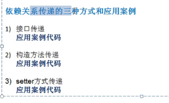

# 为什么工作中项目很少用到设计模式？
> 设计模式的目的是提供可扩展性和可维护性。但是我们开发的项目本身，大部分都是固定写死的，逻辑单一，我们开发的模块也并不在其他位置或者其他项目中复用，目的很明确就是做当前的业务，支付模块就管支付的业务，推送模块就管消息推送的业务。所以，平时开发中用到设计模式的地方很少。但是框架就不同了，框架必须适应不同的项目，具备高弹性和高扩展性。他们要能适应各种不同的环境，所以，设计模式在框架设计中处处可见。

> 世界上成千上万的项目都在使用Spring,Shiro,Mybatis，SpringBoot等,那么，他们就必须能满足各种不同的需求，使用不同的配置，插件，定制化，他们不仅要适应你，还要适应他，各种策略模式，代理模式，责任链模式，状态模式，众口难调在这里是不存在的！。比如shiro中的一个token,可能有的项目要使用简单文本密码，可能有些项目已要使用数字证书，这里就必须使用策略模式spring中的事务处理，因为他是框架，他根本不知道自己要放在哪段service对象身上，他就使用动态代理模式，动态的进行运行时施加代理。可以这么说，设计模式为扩展而生，对修改说NO,对扩展说YES! 你绝不会为了项目需要去傻傻的修改spring的源码来适应你的项目需求。

> 框架就是这样适应成千上万的项目的。我们的业务逻辑代码，平时开发项目的时候，功能是死的，是专为这个场景而生的，不会在另外的场景中出现，所以，这种代码开发，业务的开发，是不需要设计模式的。对于我们平时开发的项目，如果需求有变化，我们一般的做法，是直接修改源代码了，这样的其实带来了一定的修改成本，但是，为了一个项目中可能不明确的未来变化，而精心设计扩展性很高的架构，成本也是显而易见的，所以，这是一个取舍的过程。深层次的说这是企业开发成本与项目实际应用的一个博弈过程。

# 设计原则
## 单一职责原则
1. 降低代码复杂度
2. 提高可读性、可维护性

## 接口隔离原则
1. 客户端不应该依赖它不需要的接口。
2. 一个类对另一个类的依赖应该建立在最小的接口上 

## 依赖倒转原则
1. 高层模块不依赖低层模块，二者都应依赖其抽象
2. 抽象不依赖细节，细节依赖抽象
3. 依赖倒转是面向接口编程



## 里氏替换原则
1. 所有引用基类的地方必须能透明地使用其子类的对象。
2. 子类中尽量不要重写父类的方法！
3. 做法：让原来的父类和子类都继承一个更通用的基类，原有继承关系调整为依赖、聚合、组合等关系。

## 开闭原则
1. 模块和函数对扩展（提供方）开放，对修改（使用方）关闭。
2. 当需求变化，尽量通过扩展实体行为来实现，而不是通过修改已有代码

## 迪米特法则
1. （Law of Demeter）又叫作最少知识原则（The Least Knowledge Principle）最少知道原则，一个类对其依赖的类知道的越少越好。

## 合成复用原则
1. 尽量使用合成/聚合的方式，而不是使用继承

# UML类图
> 用于描述系统中类的组成和类之间的各种静态关系。

**类之间的关系包括：**
- 依赖
1. 作为类的成员属性
2. 作为方法的返回类型
3. 作为方法接收的参数类型
4. 方法中使用到

- 泛化（继承）
- 实现
- 关联
- 聚合
- 组合

# 代理模式
## 静态代理
> 真实对象和代理对象都要实现同一接口
> 代理对象要代理真实对象
```java
public class StaticProxy {
    public static void main(String[] args) {
        WeddingCompany wc = new WeddingCompany(new You());
        wc.goMarry();
    }
}

interface Marry{
    void goMarry();
}

class You implements Marry{
    @Override
    public void goMarry() {
        System.out.println("杰克要结婚了！");
    }
}

class WeddingCompany implements Marry{
    private Marry client;

    public WeddingCompany(Marry client){
        this.client = client;
    }
    @Override
    public void goMarry() {
        beforMarry();
        client.goMarry();
        afterMarry();
    }

    private void afterMarry() {
        System.out.println("婚礼结束收钱了！");
    }

    private void beforMarry() {
        System.out.println("婚礼布置...");
    }
}
```