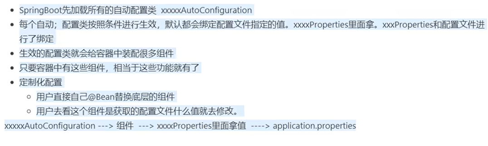
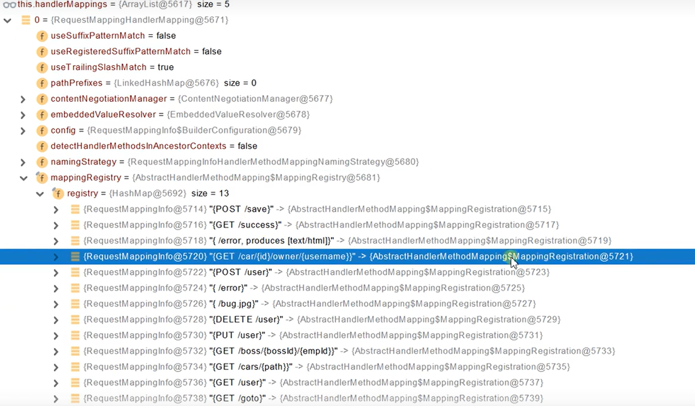
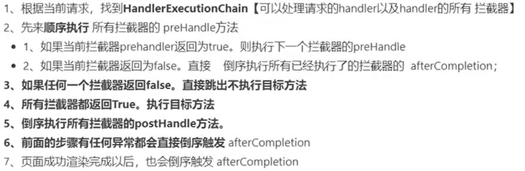
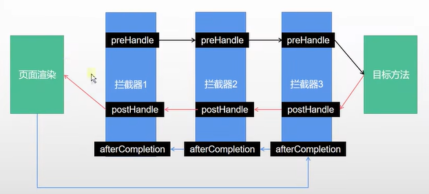
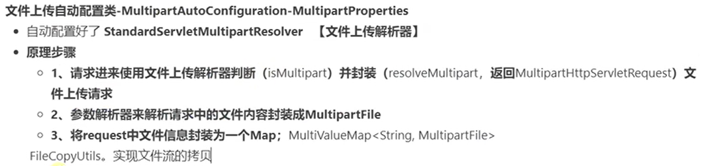
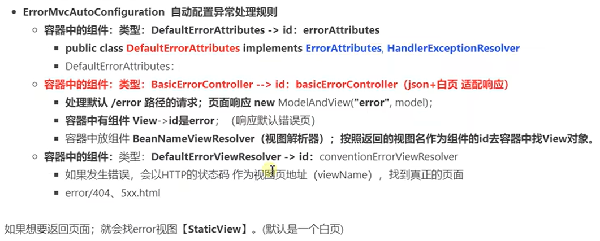

# 介绍

> 整合 Spring 技术栈，快速交付应用。

# 自动配置

- 所有的配置项都对应到具体的配置类



## @Configuration

- proxyBeanMethods：true 走 bean 生命周期单实例；false 轻量级单实例不走 bean 生命周期。

> 使用@Bean 标注在方法上给容器注册组件，默认也是单实例的。

## @Import

> @Import 注解是用来导入配置类或者一些需要前置加载的类。

## @Conditional

- 条件注入，作用在类和方法上
- 以自动注入类举例：

```java
@Configuration
@ConditionalOnClass({ EnableAspectJAutoProxy.class, Aspect.class, Advice.class,
		AnnotatedElement.class })
@ConditionalOnProperty(prefix = "spring.aop", name = "auto", havingValue = "true", matchIfMissing = true)
public class AopAutoConfiguration {

	@Configuration
	@EnableAspectJAutoProxy(proxyTargetClass = false)
	@ConditionalOnProperty(prefix = "spring.aop", name = "proxy-target-class", havingValue = "false", matchIfMissing = false)
	public static class JdkDynamicAutoProxyConfiguration {

	}

	@Configuration
	@EnableAspectJAutoProxy(proxyTargetClass = true)
	@ConditionalOnProperty(prefix = "spring.aop", name = "proxy-target-class", havingValue = "true", matchIfMissing = true)
	public static class CglibAutoProxyConfiguration {

	}

}
```

## @ConfigurationProperties

> 如果没有加@Configuration 注解，@EnableConfigurationProperties 注解来绑定属性到 POJO 中。

```java
@Configuration
@ConfigurationProperties(prefix = "mail")
public class ConfigProperties {

    private String hostName;
    private int port;
    private String from;

    // standard getters and setters
}
```

## 静态资源

/static 、 /pulic、/resources 、/META-INF/resources
先找 controller，找不到再找静态资源目录

- 指定静态资源

  - `staic-path-pattern: /res/**`
  - `static-locations: classpath:/assets`

- 原理
  - WebMvcAutoConfiguration
  - addResourceLocation

## 请求映射

- 原理
  - DispatcherServlet `doDispatch`
    - HandlerMapping
    - RequestMappingHandlerMapping -> mappingRegistry



# 常用参数注解

- @PathVariable
- @RequestParam
- @RequestBody
- @RequestHeader
- @CookieValue

## 解析原理

- HandlerMethodArgumentResolver
- 参数解析器：`argumentResolvers`
  遍历所有

## Map、Model 参数，会返回 mavContainer.getModel()

## 第一类：请求路径参数

1、@PathVariable
获取路径参数。即 url/{id}这种形式。

2、@RequestParam
获取查询参数。即 url?name=这种形式

例子
GET
http://localhost:8080/demo/123?name=suki_rong
对应的 java 代码：

```java
@GetMapping("/demo/{id}")
public void demo(@PathVariable(name = "id") String id, @RequestParam(name = "name") String name) {
    System.out.println("id="+id);
    System.out.println("name="+name);
}
```

输出结果：
id=123
name=suki_rong

## 第二类：Body 参数

因为是 POST 请求，请求参数为 json 类型，这里用 Postman 的截图结合代码说明
`application/json`
1、@RequestBody
例子：

```json
{
  "id": 12,
  "name": "jack"
}
```

```java
@PostMapping(path = "/demo1")
public void demo1(@RequestBody Person person) {
    System.out.println(person.toString());
}
```

输出结果：
suki_rong

2、无注解
应对请求方式为：`form-data`
例子

Person 类:

```java
public class Person {

    private long id;
    private String name;
    private int age;
    private String hobby;

    @Override
    public String toString(){
        return "name:"+name+";age="+age+";hobby:"+hobby;
    }

    // getters and setters
}
```

```java
@PostMapping(path = "/demo2")
public void demo2(Person person) {
    System.out.println(person.toString());
}
```

## 第三类：请求头参数以及 Cookie

1、@RequestHeader
2、@CookieValue
例子

java 代码：

```java
@GetMapping("/demo3")
public void demo3(@RequestHeader(name = "myHeader") String myHeader,
        @CookieValue(name = "myCookie") String myCookie) {
    System.out.println("myHeader=" + myHeader);
    System.out.println("myCookie=" + myCookie);
}

// 或者：
@GetMapping("/demo3")
public void demo3(HttpServletRequest request) {
    System.out.println(request.getHeader("myHeader"));
    for (Cookie cookie : request.getCookies()) {
        if ("myCookie".equals(cookie.getName())) {
            System.out.println(cookie.getValue());
        }
    }
}
```

# 拦截器原理




# 文件上传

- MutipartFile
- MutipartFile[] 多文件
- 修改最大上传大小限制 `max-file-size`

## 原理



# 数据访问

# 异常处理



# 单元测试

# 指标监控

# 高级特性
