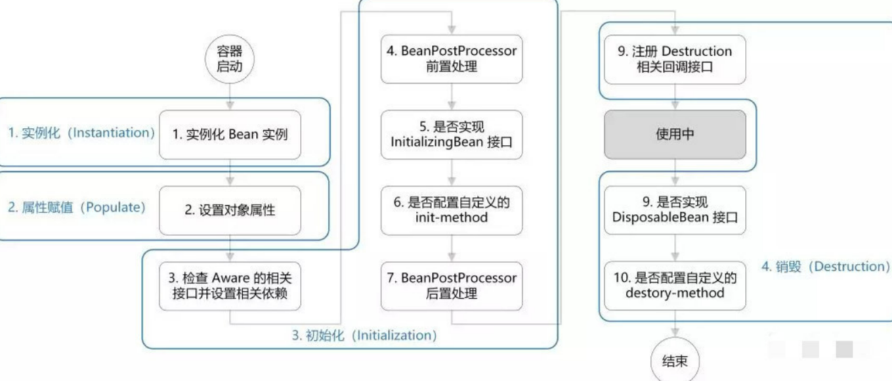

# Spring5

# 源码地址：

[https://gitee.com/javaproejct/spring_tutorial](https://gitee.com/javaproejct/spring_tutorial)

## IOC

`Inversion of Control`控制反转，把对象的创建和对象之间的调用过程，交给 Spring 进行管理。
降低耦合度。

## Bean 管理

> 默认单实例对象 `singleton`，scope=`prototype` 可以指定多实例。

## singleton 和 prototype 区别

1. singleton 单实例，prototype 多实例
2. 单实例模式下，加载 spring 配置文件时创建实例对象;
3. 多实例模式下，是在调用 getBean 方法时创建多实例对象。

## bean 生命周期



### xml 方式管理 bean

- 创建对象 `<bean></bean>`
- 属性注入 `<property></property>` 或`p命名空间`
- 构造函数注入 `<constructor-arg></constructor-arg>`

### 基于注解方式

1. @Component
2. @Sevice
3. @Controller
4. @Repository

- @Autowire 默认基于类型注入
- @Qualifier 根据属性名称注入
- @Resource javax 扩展,推荐使用
- @Configuration 配置类
-

- 根据属性名称自动注入
- 开启包扫描：`@ComponentScan(value = {"com.example", "com.fox"})`

## @Resource 装配顺序

1. 如果同时指定了 name 和 type，则从 Spring 上下文中找到唯一匹配的 bean 进行装配，找不到则抛出异常
2. 如果指定了 name，则从上下文中查找名称（id）匹配的 bean 进行装配，找不到则抛出异常
3. 如果指定了 type，则从上下文中找到类型匹配的唯一 bean 进行装配，找不到或者找到多个，都会抛出异常
4. 如果既没有指定 name，又没有指定 type，则自动按照 byName 方式进行装配；如果没有匹配，则回退为一个原始类型进行匹配，如果匹配则自动装配；

## 为何不推荐使用@Autowired？

1. 容易引发 NPE

> 通过 @Autowired 注入的 user 对象可能为空，而 JVM 虚拟机在编译时也无法检测出 user 为 null，只有在运行时调用 user 的方法时， 发现 user 为 null，出现空指针异常(NPE)

2. 违反单一职责原则

   > 使用基于字段的注解，我们无需关注类之间的依赖关系，完全依赖于 spring IOC 容器的管理，但是使用”基于构造器注入的方式”， 我们需要手动在类代码中去编写需要依赖的类，当依赖的类越来越多，我们就能发现 code smell，这个时候就能显示的提醒我们，代码的质量是否有问题

3. 无法注入 final 或者 static 对象
4. byType 方式注入在可能存在多个相同类型 bean 情况下注入失败

### 底层原理

- xml 解析
- 反射
- 工厂模式：
  - BeanFactory：内置，一般不使用；获取对象时才会创建；
  - `ApplicationContext`：子接口，提供更多功能；加载配置文件即创建

# AOP

## 术语解释

- 通知（Advice）包含了需要用于多个应用对象的横切行为，完全听不懂，没关系，通俗一点说就是定义了“什么时候”和“做什么”。

- 连接点（Join Point）是程序执行过程中能够应用通知的所有点。

- 切点（Poincut）是定义了在“什么地方”进行切入，哪些连接点会得到通知。显然，切点一定是连接点。

- 切面（Aspect）是通知和切点的结合。通知和切点共同定义了切面的全部内容——是什么，何时，何地完成功能。

- 引入（Introduction）允许我们向现有的类中添加新方法或者属性。

- 织入（Weaving）是把切面应用到目标对象并创建新的代理对象的过程，分为编译期织入、类加载期织入和运行期织入。

# JdbcTemplate

> JdbcTemplate 是 Spring 对 JDBC 的封装，目的是使 JDBC 更加易于使用。JDBC 如同是毛坯房，而 JdbcTemplate 类似于精装房，使用 JdbcTemplate 会更舒坦一些。

## 操作分类

（1）execute：可以执行所有 SQL 语句，一般用于执行 DDL 语句。

（2）update：用于执行 INSERT、UPDATE、DELETE 等 DML 语句。

（3）queryXXX：用于 DQL 数据查询语句。

- RowMapper 可以将数据中的每一行数据封装成用户定义的类
-

## 事务管理

- 启动类：@EnableTransactionManagement
- 声明式事务：@Transactional 在方法的开头开始事务，在方法的结束提交事务
- 底层用到 AOP
  > 通过 AOP 对目标方法进行拦截，在方法的开始出开始事务(或者加入事务)，在方法结束时提交事务，当发生异常时回滚事务， 可以通过

> 针对非运行时异常，如果要进行事务回滚的话，可以在 @Transactional 注解中使用 rollbackFor 属性来指定异常，比如 @Transactional(rollbackFor = Exception.class) ，这样就没有问题了，所以在实际项目中，一定要指定异常。

```java
@Transactional
public void add(User user){
    jdbcTemplate.update("insert into tb_user(username,password) values(?,?)", user.getUsername(), user.getPassword());
    int a = 1/0;
    jdbcTemplate.update("delete from tb_user where id=?",3);
}

```

- @Transactional 一般用在方法上，对于查询方法不需要使用事务，如果用在类上，对查询方法的性能有影响
- @Transactional 注解只能应用到 public 可见度的方法上。 如果你在 protected、private 或者
  package-visible 的方法上使用 @Transactional 注解，它也不会报错,但是这个被注解的方法将不会展示已配置的事务设置
- 一个没有事务的 方法 A 调用有事务的 方法 B ,则 A 调用的 B 的事务不会生效。比如
  OrderService，它的一个方法 addShoppingCart，addShoppingCart 再调用 OrderService 本类的方法 doAddShoppingCart（不管 doAddShoppingCart 是否 public 还是 private），但 addShoppingCart 没有声明注解事务，而 B 有。则外部调用 addShoppingCart 之后，doAddShoppingCart 的事务是不会起作用的。

# webflux

> Spring WebFlux 是一个异步非阻塞式的 Web 框架，它能够充分利用多核 CPU 的硬件资源去处理大量的并发请求。
> 特适合于 IO 密集型的服务中，比如微服务网关。

## 响应式编程

> 指的是一种面向数据流并传播事件的异步编程范式（asynchronous programming paradigm）.
> 响应式编程最初是为了简化交互式用户界面的创建和实时系统动画的绘制而提出来的一种方法，但它本质上是一种通用的编程范式。
> 简单来说，在 Reactive 方式中，上一个任务执行结果的反馈就是一个事件，这个事件的到来将会触发下一个任务的执行。

- 实现 Reactive 模型最核心的是线程和消息管道
- 线程用于侦听事件，消息管道用于 Reactor 之间通信不同的消息。与他们相关的是事件管理器用于注册、注销事件，而消息分配器则会根据消息类型分发.
-
