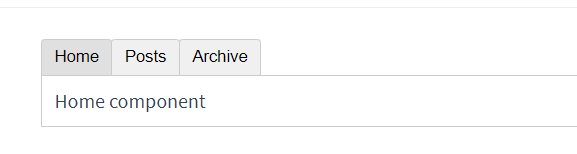
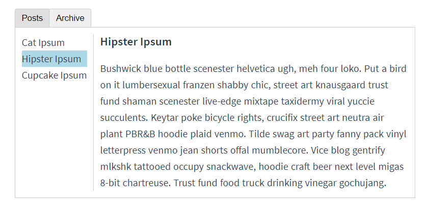
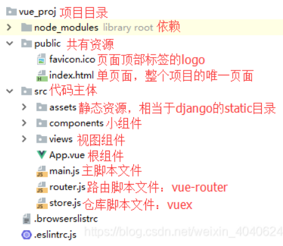
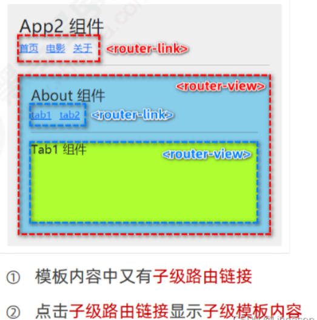
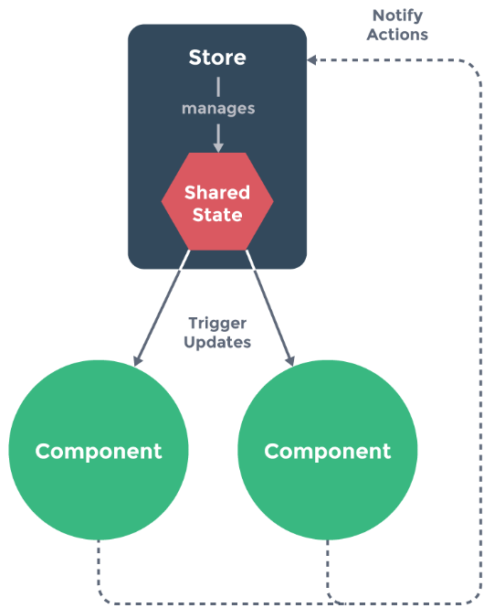

# 学习前提

掌握`html` `css` `javascript`基础。推荐学习路线：
[https://developer.mozilla.org/zh-CN/docs/orphaned/Learn](https://developer.mozilla.org/zh-CN/docs/orphaned/Learn)

# MVVM 模型

[介绍](https://blog.csdn.net/weixin_54614831/article/details/126410389)

> MVVM 的核心思想：是关注 Model 的变化。让 MVVM 框架利用自己的机制自动更新 DOM（即所说的 View 视图），也就是所谓的数据-视图分离。

# Mustache 语法

https://blog.csdn.net/liangtaox8/article/details/100697480

# 虚拟 DOM

https://www.cnblogs.com/luckest/p/16868808.html

`diff`算法

# 实例生命周期


# 模板语法

## 指令 v-bind 和 v-on

> 指令的职责是，当表达式的值改变时，将其产生的连带影响，响应式地作用于 DOM

```html
<p v-if="seen">现在你看到我了</p>
<a v-bind:href="url">...</a>
<a v-on:click="doSomething">...</a>
```

- v-if
- v-bind -> :
- v-on -> @

# 计算属性和监听器

## 计算属性

> 任何复杂逻辑，你都应当使用计算属性

```html
<div id="example">
  <p>Original message: "{{ message }}"</p>
  <p>Computed reversed message: "{{ reversedMessage }}"</p>
</div>
```

```js
computed: {
    // 计算属性的 getter
    reversedMessage: function () {
      // `this` 指向 vm 实例
      return this.message.split('').reverse().join('')
    }
  }
```

- get 和 set 方法

```js
computed: {
  fullName: {
    // getter
    get: function () {
      return this.firstName + ' ' + this.lastName
    },
    // setter
    set: function (newValue) {
      var names = newValue.split(' ')
      this.firstName = names[0]
      this.lastName = names[names.length - 1]
    }
  }
}
```

- 计算属性 vs 方法
  > 算属性是基于它们的响应式依赖进行缓存的，方法不会缓存。不希望有缓存，请用方法来替代。

## 侦听器 watch

> 需要在数据变化时执行异步或开销较大的操作时
> 使用 watch 选项允许我们执行异步操作 (访问一个 API)，限制我们执行该操作的频率，并在我们得到最终结果前，设置中间状态。这些都是计算属性无法做到的

```js
watch: {
    // 如果 `question` 发生改变，这个函数就会运行
    question: function (newQuestion, oldQuestion) {
      this.answer = 'Waiting for you to stop typing...'
      this.debouncedGetAnswer()
    }
  },
```

- 防抖 debounce
  > 在一定时间间隔内函数被触发多次，但只执行最后一次。
  > 我们在做搜索功能的时候，如果每输入一个字符就调用一次接口，会导致请求过于频繁。但这些请求中，只有最后一个请求是有意义的，因为最后一个请求发出时，我们已经输入了完整的搜索词，而前面没有意义的请求，是对网络资源的浪费。此时就可以使用 debounce，把触发非常频繁的事件合并成一次执行
- 节流(Throttle)
  > 允许一个函数在 X 毫秒内只执行一次。
  > 当你需要监听滚动条变化，从而去计算页面中某个元素到窗口顶部距离的时候。可以使用 Throttle，不用实时去计算元素的位置，而是一段时间计算一次，可以避免频繁执行代码，防止浏览器频繁响应事件，严重拉低性能。

[more>>](https://lodash.com/docs#debounce)

# 绑定 HTML Class

```html
<div
  class="static"
  v-bind:class="{ active: isActive, 'text-danger': hasError }"
></div>
```

```js
data: {
  isActive: true,
  hasError: false
}
```

# 绑定 style

```html
<div v-bind:style="styleObject"></div>
```

```js
styleObject: {
    color: 'red',
    fontSize: '13px'
  }
```

# 条件渲染

## v-if

```html
<template v-if="loginType === 'username'">
  <label>Username</label>
  <input placeholder="Enter your username" key="username-input" />
</template>
<template v-else>
  <label>Email</label>
  <input placeholder="Enter your email address" key="email-input" />
</template>
```

## v-show

因此，如果需要非常频繁地切换，则使用 v-show 较好；如果在运行时条件很少改变，则使用 v-if 较好。

# 列表渲染

```html
<ul id="example-2">
  <li v-for="(item, index) in items">
    {{ parentMessage }} - {{ index }} - {{ item.message }}
  </li>
</ul>
```

```js
var example2 = new Vue({
  el: "#example-2",
  data: {
    parentMessage: "Parent",
    items: [{ message: "Foo" }, { message: "Bar" }],
  },
});
```

# 事件处理

```js
// 在 `methods` 对象中定义方法
  methods: {
    greet: function (event) {
      // `this` 在方法里指向当前 Vue 实例
      alert('Hello ' + this.name + '!')
      // `event` 是原生 DOM 事件
      if (event) {
        alert(event.target.tagName)
      }
    }
  }
```

## 事件修饰符

- .stop
- .prevent
- .capture
- .self
- .once
- .passive

# 表单输入绑定

- 复选框举例

```html
<input type="checkbox" id="jack" value="Jack" v-model="checkedNames" />
<label for="jack">Jack</label>
<input type="checkbox" id="john" value="John" v-model="checkedNames" />
<label for="john">John</label>
<input type="checkbox" id="mike" value="Mike" v-model="checkedNames" />
<label for="mike">Mike</label>
<br />
<span>Checked names: {{ checkedNames }}</span>
```

```js
new Vue({
  el: "...",
  data: {
    checkedNames: [],
  },
});
```

- 用 v-for 渲染的动态选项

```html
<select v-model="selected">
  <option v-for="option in options" v-bind:value="option.value">
    {{ option.text }}
  </option>
</select>
<span>Selected: {{ selected }}</span>
```

```js
new Vue({
  el: "...",
  data: {
    selected: "A",
    options: [
      { text: "One", value: "A" },
      { text: "Two", value: "B" },
      { text: "Three", value: "C" },
    ],
  },
});
```

# 命令行工具 (CLI)

# 组件开发

1. 每用一次组件，就会有一个它的新实例被创建。
2. 组件的 data 必须是一个函数
3. 自定义组件名 (字母全小写且必须包含一个连字符)

## 通过 Prop 向子组件传递数据

> Prop 是你可以在组件上注册的一些自定义 attribute。当一个值传递给一个 prop attribute 的时候，它就变成了那个组件实例的一个 property

```js
Vue.component("blog-post", {
  props: ["post"],
  template: `
    <div class="blog-post">
      <h3>{{ post.title }}</h3>
      <div v-html="post.content"></div>
    </div>
  `,
});
```

```html
<blog-post
  v-for="post in posts"
  v-bind:key="post.id"
  v-bind:post="post"
></blog-post>
```

## 监听子组件事件

```html
<div id="app">
  <div :style="{ fontSize: postFontSize + 'em' }">
    <blog-post
      v-for="post in posts"
      v-bind:post="post"
      v-on:enlarge-text="onEnlargeText"
    ></blog-post>
  </div>
</div>
```

```js
Vue.component("blog-post", {
  props: ["post"],
  template: `
    <div class="blog-post">
      <h3>{{ post.title }}</h3>
      <button v-on:click="$emit('enlarge-text',0.1)">
        Enlarge text
      </button>
      <div v-html="post.content"></div>
    </div>
  `,
});
```

```js
var app = new Vue({
  el: "#app",
  data: {
    postFontSize: 1,
    posts: [
      {
        title: "普京发表国情咨文",
        content: "俄舞战争走势，究竟前方迷雾多少，各位看官有何高见？",
      },
    ],
  },
  methods: {
    onEnlargeText: function (enlargeAmount) {
      this.postFontSize += enlargeAmount;
    },
  },
});
```

## 通过插槽分发内容

```js
Vue.component("alert-box", {
  template: `
    <div class="demo-alert-box">
      <strong>Error!</strong>
      <slot></slot>
    </div>
  `,
});
```

```html
<alert-box> Something bad happened. </alert-box>
```

## 动态组件

> 有的时候，在不同组件之间进行动态切换是非常有用的，比如在一个多标签的界面里
> 

- 案例

```html
<!DOCTYPE html>
<html>
  <head>
    <title>Dynamic Components Example</title>
    <script src="https://unpkg.com/vue@2"></script>
    <style>
      .tab-button {
        padding: 6px 10px;
        border-top-left-radius: 3px;
        border-top-right-radius: 3px;
        border: 1px solid #ccc;
        cursor: pointer;
        background: #f0f0f0;
        margin-bottom: -1px;
        margin-right: -1px;
      }
      .tab-button:hover {
        background: #e0e0e0;
      }
      .tab-button.active {
        background: #e0e0e0;
      }
      .tab {
        border: 1px solid #ccc;
        padding: 10px;
      }
    </style>
  </head>
  <body>
    <div id="dynamic-component-demo" class="demo">
      <button
        v-for="tab in tabs"
        v-bind:key="tab"
        v-bind:class="['tab-button', { active: currentTab === tab }]"
        v-on:click="currentTab = tab"
      >
        {{ tab }}
      </button>

      <component v-bind:is="currentTabComponent" class="tab"></component>
    </div>

    <script>
      Vue.component("tab-home", {
        template: "<div>Home component</div>",
      });
      Vue.component("tab-posts", {
        template: "<div>Posts component</div>",
      });
      Vue.component("tab-archive", {
        template: "<div>Archive component</div>",
      });

      new Vue({
        el: "#dynamic-component-demo",
        data: {
          currentTab: "Home",
          tabs: ["Home", "Posts", "Archive"],
        },
        computed: {
          currentTabComponent: function () {
            return "tab-" + this.currentTab.toLowerCase();
          },
        },
      });
    </script>
  </body>
</html>
```

## vue 父组件传递方法 :和@的区别

1. `@`是 v-on 指令的简写，表示监听事件；
   用于父子组件之间方法的传递
   `@`是 v-on 的简写，是为组件绑定事件，子组件不需要接收，在子组件的$listeners上可以找到，可以使用`this.$emit('xxx')`手动触发，这样就会触发事件上绑定的函数
   v-on:abc 其原理相当于父组件给子组件传了一个邮箱地址 abc，子组件需要的时候往这个地址发邮件，父组件就能从邮件里拿到子组件发送的信息。

2. `:`是 v-bind 指令的简写，表示绑定参数。
   用于父子组件之间值传递
   `:`是 `v-bind` 的简写，是为组件传递属性，这里属性可以是任意类型的，在子组件中需要使用 props 接收，在子组件的$props上可以找到(对于未使用props接收的属性，可以在$attrs 上找到)，如果传入的数据是一个函数，那么就可以使用 this.xxx()，手动调用函数。

# 模块系统

推荐创建一个 components 目录，并将每个组件放置在其各自的文件中，然后你需要在局部注册之前导入每个你想使用的组件。例如，在一个假设的 ComponentB.js 或 ComponentB.vue 文件中：

```js
import ComponentA from "./ComponentA";
import ComponentC from "./ComponentC";

export default {
  components: {
    ComponentA,
    ComponentC,
  },
  // ...
};
```

## Props

> Spring boot+VUE 实现 token 验证,通常你希望每个 prop 都有指定的值类型

```js
props: {
  title: String,
  likes: Number,
  isPublished: Boolean,
  commentIds: Array,
  author: Object,
  callback: Function,
  contactsPromise: Promise // or any other constructor
}
```

## 单向数据流

> 所有的 prop 都使得其父子 prop 之间形成了一个单向下行绑定：父级 prop 的更新会向下流动到子组件中，但是反过来则不行。这样会防止从子组件意外变更父级组件的状态，从而导致你的应用的数据流向难以理解

# 插槽

## 具名插槽

## 作用域插槽

## 动态组件

> 在动态组件上使用 keep-alive
> 当在这些组件之间切换的时候，你有时会想保持这些组件的状态，以避免反复重新渲染导致的性能问题。例如我们来展开说一说这个多标签界面：
> 

```html
<!-- 失活的组件将会被缓存！-->
<keep-alive>
  <component v-bind:is="currentTabComponent"></component>
</keep-alive>
```

## 异步组件

## 访问父级组件实例

$parent property 可以用来从一个子组件访问父组件的实例。它提供了一种机会，可以在后期随时触达父级组件，以替代将数据以 prop 的方式传入子组件的方式

## 访问子组件实例或子元素

```html
<base-input ref="usernameInput"></base-input>
```

现在在你已经定义了这个 ref 的组件里:
`this.$refs.usernameInput`

# 可复用性和组合

## 自定义指令

```js
directives: {
  focus: {
    // 指令的定义
    inserted: function (el) {
      el.focus()
    }
  }
}
```

```html
<input v-focus />
```

## 钩子函数

## 过滤器

> Vue.js 允许你自定义过滤器，可被用于一些常见的文本格式化。过滤器可以用在两个地方：双花括号插值和 v-bind 表达式

```html
<!-- 在双花括号中 -->
{{ message | capitalize }}

<!-- 在 `v-bind` 中 -->
<div v-bind:id="rawId | formatId"></div>
```

```js
filters: {
  capitalize: function (value) {
    if (!value) return ''
    value = value.toString()
    return value.charAt(0).toUpperCase() + value.slice(1)
  }
}
```

# Vue CLI

> Vue2.0 脚手架，CLI (@vue/cli) 是一个全局安装的 npm 包，提供了终端里的 vue 命令。它可以通过 vue create 快速搭建一个新项目，或者直接通过 vue serve 构建新想法的原型。你也可以通过 vue ui 通过一套图形化界面管理你的所有项目。

```bash
npm install -g @vue/cli
vue --version
# 创建项目
vue create vue-hello
# 手动选择插件 选取Router, Vuex插件
cd vue-hello
npm run serve
访问：http://localhost:8080/
```



# 路由 Vue-router

## router-link 和 router-view

当安装了 vue-router 后，就可以使用 router-link 代替 a 链接。


# Vuex 状态管理

> 如果你有一处需要被多个实例间共享的状态，可以简单地通过维护一份数据来实现共享,为了解决这个问题，我们采用一个简单的 `store 模式`：
> 

- 视图（view）发送动作（action）到派发器（dispatcher）
- 派发器（dispatcher）发送动作（action）到每一个存储（store）
- 存储（store）发送数据（data）到视图（view）
  [mapMutations 详细讲解](https://blog.csdn.net/feifantiantang/article/details/111995635)

# mixin 混入

> 将组件的公共逻辑或者配置提取出来，哪个组件需要用到时，直接将提取的这部分混入到组件内部即可。这样既可以减少代码冗余度，也可以让后期维护起来更加容易.

- 和 vuex 区别：

1. Vuex 公共状态管理，如果在一个组件中更改了 Vuex 中的某个数据，那么其它所有引用了 Vuex 中该数据的组件也会跟着变化。
2. Mixin 中的数据和方法都是独立的，组件之间使用后是互相不影响的

```js
// src/mixin/index.js
import { mixins } from "./mixin/index";
export default {
  name: "App",
  mixins: [mixins],
  components: {},
  created() {
    console.log("组件调用minxi数据", this.msg);
  },
  mounted() {
    console.log("我是组件的mounted生命周期函数");
  },
};
```

```js
import { mixins } from "./mixin/index";
export default {
  name: "App",
  mixins: [mixins],
  components: {},
  created() {
    console.log("组件调用minxi数据", this.msg);
  },
  mounted() {
    console.log("我是组件的mounted生命周期函数");
  },
};
```

- 全局混入

```js
import { mixins } from "./mixin/index";
Vue.mixin(mixins);
```

# 插件 plugin

# 过滤器

> Vue.js 允许你自定义过滤器，可被用于一些常见的文本格式化

```html
<!-- 在双花括号中 -->
{{ message | capitalize }}

<!-- 在 `v-bind` 中 -->
<div v-bind:id="rawId | formatId"></div>
```

```js
filters: {
  capitalize: function (value) {
    if (!value) return ''
    value = value.toString()
    return value.charAt(0).toUpperCase() + value.slice(1)
  }
}
// 或者
Vue.filter('capitalize', function (value) {
  if (!value) return ''
  value = value.toString()
  return value.charAt(0).toUpperCase() + value.slice(1)
})
```

# webstorage

- sessionStorage: 浏览器关闭后清除
- localStorage：举例：电商网站搜索历史

# watch 深度监视

# this.$emit('事件名',param)子组件触发自定义绑定事件
